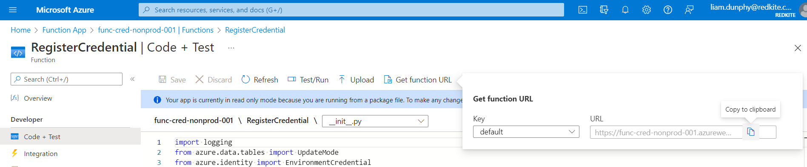

# Registering Credentials

## Overview

For a credential to be rotated by this function app it must be registered in the `Credential Metastore` (Azure Table Storage).

The metastore contains all the details required to rotate a credential - the exact properties to rotate a credential are determined by the credential type. This document outlines the schemas which should be provided to register each credential type with respect to their required properties and should be updated as new credential types are added to this application.

All credential registration is handled via POST request.

## Function Endpoint

The function endpoint is driven by the name of the Function App along with the default function key - the easiest way to retrieve this is to navigate to the `RegisterCredential` function within the function app from the Azure Portal and copy the function URL as shown below.



## Request Body Schemas

### ServicePrincipalCredential

``` jsonc
{
    "CredentialType": "ServicePrincipalCredential",              # Don't change this.
    "PartitionKey": "my-key-vault-name",                         # The name of the Key Vault the secret will be stored in.
    "RowKey": "my-secret-name",                                  # The name of the secret you want to create / update in Key Vault.
    "DaysUntilRotation": 30,                                     # The frequency of the Service Principal's secret being rotated.
    "DaysUntilExpiration": 60,                                   # The lifetime of the secret value. This should be greater than the DaysUntilRotation value.
    "AppRegObjectId": "xxxxxxxx-xxxx-xxxx-xxxx-xxxxxxxxxxxx",    # The Service Principal's Application Registration Object ID.
    "AppRegName": "my-service-principal"                         # The name of the Service Principal.
}
```
