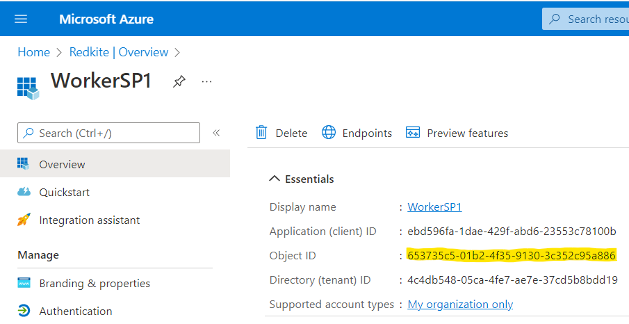
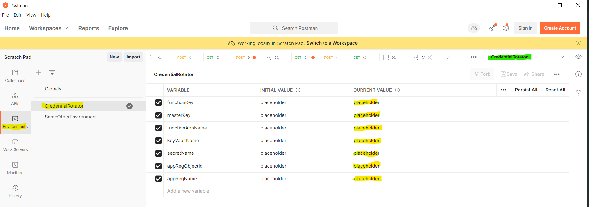

# Credential Rotator

- [Credential Rotator](#credential-rotator)
  - [Introduction](#introduction)
  - [Repo Structure](#repo-structure)
  - [Setup Requirements](#setup-requirements)
    - [Azure + Azure Active Directory](#azure--azure-active-directory)
      - [Resource Groups](#resource-groups)
      - [Service Principals](#service-principals)
      - [Required Permissions](#required-permissions)
      - [Scripts](#scripts)
    - [Azure DevOps Requirements](#azure-devops-requirements)
      - [Variable Groups](#variable-groups)
      - [Service Connections](#service-connections)
      - [Environments](#environments)
  - [Usage](#usage)
    - [Components](#components)
  - [Demo](#demo)
    - [Registering a Service Principal for Rotation](#registering-a-service-principal-for-rotation)
  - [Developer Reference](#developer-reference)
    - [Virtual Environment Activation](#virtual-environment-activation)
    - [Function App Development](#function-app-development)
      - [Setting Up Local Environment](#setting-up-local-environment)
      - [Extending Supported Credentials](#extending-supported-credentials)
  - [Known Issues](#known-issues)

## Introduction

The Credential Rotator application is an Azure Function designed to simplify the rotation, management, and alerting of Azure credential operations to ensure automated Platform stability.


## Repo Structure

The top-level directory structure of the repo looks as follows:

``` sh
.
├───.build         # Contains IaC + CICD Pipeline Templates.
├───.docs          # Project documentation.
├───.media         # Images / videos used in documentation.
├───.vscode        # VS Code specific settings for developers.
├───postman        # Postman Environment + Collection details for triggering app.
├───scripts        # Helper scripts for setting up project dependencies.
└───src            # Core Source Code files for CredentialRotator Application.
```

## Setup Requirements

### Azure + Azure Active Directory

#### Resource Groups

Resource Groups must exist in Azure in order to deploy Credential Rotator resources (one resource group per environment). These resource groups do not need to conform to any naming convention, but they do need to have appropriate permissions in place to allow the deployment of resources (see [Required Permissions](#required-permissions)).

#### Service Principals

This project uses Service Principals to handle the following authentication requirements:

- **Credential Rotator Service Principal**: Manage the rotation of credentials.
- **Deployment Service Principal(s)**: Deploy the Credential Rotator Resources into the target resource groups.
  
  > You may wish to have one Service Principal per deployment environment (e.g. a "Non-Production" and "Production" Service Principal to handle deployments into a "Non-Production" and "Production" resource group respectively).

#### Required Permissions

The following permissions need to be granted for the Credential Rotator application to work:

- The **Credential Rotator Service Principal** needs the following API Permissions granted to it from within Azure AD - `Directory.Read.All` + `Application.ReadWrite.OwnedBy`. These are needed so that the Service Principal can lookup applications in Azure AD and manage them as an owner.

> You can set these permissions by navigating to Azure Active Directory > App Registrations > *Your Service Principal Name* > API Permissions > Add a permission > Microsoft Graph > Application permissions > Select `Directory.Read.All` + `Application.ReadWrite.OwnedBy` > Add permissions. Your API Permissions may require admin approval from your Azure AD admin, so please seek this if required before continuing.


- The **Deployment Service Principal(s)** requires **one** of the following RBAC role combinations applied at the target resource group in order to deploy resources:
  - `Owner`
  - `Contributor` + `User Access Administrator`

> :warning: Can't get User Admin Access?
>
> You can set the bicep parameter `canAssignRbacRoles` to `false`. You will then need to have someone with appropriate permissions assign the following roles:

| Identity | Role | Scope |
| ----------- | ----------- | ----------- |
| Credential Rotator Service Principal - Enterprise Application Object ID | [Storage Table Data Contributor](https://docs.microsoft.com/en-us/azure/role-based-access-control/built-in-roles#storage-table-data-contributor) | Storage Account |
| Credential Rotator Service Principal - Enterprise Application Object ID | [Key Vault Secrets Officer](https://docs.microsoft.com/en-us/azure/role-based-access-control/built-in-roles#key-vault-secrets-officer) | Key Vault |
| User Managed Identity - Principal ID | [Key Vault Secrets User](https://docs.microsoft.com/en-us/azure/role-based-access-control/built-in-roles#key-vault-secrets-user) | Key Vault |

#### Scripts

In order to manage other Service Principals, the Service Principal used by the Credential Rotator application must be listed as an Owner of any child Service Principals in Azure AD.

It is not currently possible to add a Service Principal as an owner of another Service Principal from within the Azure Portal, so scripts have been provided to manage this for you.

These scripts must be run by a user with the appropriate permissions to assign ownership of a Service Principal to another identity - typically this means that you (the user running the script) need to be an owner of the Service Principal to begin with, or have an appropriate AD Role for managing Service Principals globally.

Please consult the [Automating Service Principal AD Configuration](./scripts/README.md) documentation for further details.

### Azure DevOps Requirements

#### Variable Groups

The YAML which deploys the Credential Rotator application is parameterized by accessing Variable Groups at deployment time. The following variable group(s) need to be created to enable this (one per deployment environment):

- **Variable Group Name**: *Your choice! Make sure you update the reference to the group inside of [the root YAML file](./azure-pipelines.yaml) so it can be passed to the deployment.*
- **Variables**:
  - Any Bicep parameters exposed in [main.parameters.json](.build/bicep/main.parameters.json): Variables are substituted in using the File Transform task located in [azure-pipelines-deploy-infra.yaml](.build\templates\infra\azure-pipelines-deploy-infra.yaml). The File Transform tasks substitutes variables from the Azure DevOps Variable group that map to a JSON property [using dot path notation](https://docs.microsoft.com/en-us/azure/devops/pipelines/tasks/transforms-variable-substitution?view=azure-devops&tabs=Classic#json-variable-substitution-example). For example, if we wanted to parametrise the bicep parameter `sendgridApiKey` we would need to add a variable to our group in Azure DevOps named `parameters.sendgridApiKey.value`. Consider the below JSON as a guide for what variables you should look to include:


``` json
{ 
  "global.resourceGroupName": "",
  "global.subscriptionId": "",
  "parameters.emailAlertRecipients.value": "",
  "parameters.emailAlertSender.value": "",
  "parameters.environmentSuffixName.value": "",
  "parameters.resourceBaseName.value": "",
  "parameters.sendgridApiKey.value": "",
  "parameters.servicePrincipalApplicationRegistrationClientID.value": "",
  "parameters.servicePrincipalApplicationRegistrationClientSecret.value": "",
  "parameters.servicePrincipalEnterpriseApplicationObjectID.value": ""
}
  ```

#### Service Connections

To utilise the Deployment Service Principal(s) in our Azure Pipelines we need to create [Service Connections](https://docs.microsoft.com/en-us/azure/devops/pipelines/library/connect-to-azure?view=azure-devops#create-an-azure-resource-manager-service-connection-with-an-existing-service-principal). These Service Connections are referenced within our YAML Pipelines - you can name these whatever you want, just ensure that you then update the reference in the [the root YAML file](./azure-pipelines.yaml).

#### Environments

The YAML Pipelines used in this project leverage Azure DevOps Environments so that Release Approvals and Security can be easily configured. [Environments need to be created](https://docs.microsoft.com/en-us/azure/devops/pipelines/process/environments?view=azure-devops) and then referenced from within our YAML Pipelines - you can name these whatever you want, just ensure that you then update the reference in the [the root YAML file](./azure-pipelines.yaml).

## Usage

### Components

The Credential Rotator is provided as an Azure Function application, which exposes the following functions:

- [RegisterCredential](.docs/registering-credentials.md)
- [RotateCredential](.docs/rotating-credentials.md)
- [SendEmailAlert](.docs/alerting-on-rotation.md)

The logical workflow of the application is that Credentials must be first registered for rotation by the user, after which their automatic rotation is managed by the Function App. When a credential is rotated, an email alert is sent out to users as defined in the App Settings of the Function App.

For more details on these functions, follow the links above.

## Demo

### Registering a Service Principal for Rotation

> This demo assumes you already have a Service Principal created to handle rotating the child Service Principal's credentials.

1. If you don't already have a Service Principal, [create one!](https://docs.microsoft.com/en-us/azure/active-directory/develop/howto-create-service-principal-portal#register-an-application-with-azure-ad-and-create-a-service-principal)

2. From Azure Active Directory, navigate to Application Registrations grab the Object ID of the Service Principal you want to be rotated.



3. Update the [managed-apps.json](./scripts/managed-apps.json) file to include your Service Principal - only the `id` property is used in the subsequent script execution, so the `metadata` property (and any other properties you add in) are ignored (but may be useful to label the SP).


1. Get the Enterprise Application Object ID of the Service Principal which is going to be doing the rotating - this is the one we assigned MS Graph permissions to as described in the [Required Permissions](#required-permissions) section. From Azure Active Directory, navigate to Enterprise Applications and grab the Object ID of the Service Principal.


5. Execute the `configure.py` file as follows (assumes you are working out of the project root):

``` sh
python -m venv .venv # Depending on how you've setup python you may need to use python3 instead.
.venv/Scripts/activate
pip install -r src/functionapp/requirements.txt
python scripts/configure.py --enterprise-app-object-id xxxxxxxx # replace this ID with the one from step 4.
```

6. Open Postman on your machine and select the `Import` button from the main menu. You should then be prompted with an overlay - select the `Upload Files` option and import the [two Postman files](./postman/) from the repo.


7. Once imported, the environment settings for Postman will need to be updated to point to your target environment - the values set by default are placeholders. Start by updating the current values section for all the variables (marked in yellow), and then ensure that Postman is using the environment by setting the value from the dropdown in the top right (marked in green).



| :memo: Where do you find these values?          |
|:---------------------------|
|  `functionKey:` Retrieved by navigating to the following tab of the Function App in the Azure Portal - *Functions > RegisterCredential > Function Keys*.    |
|  `masterKey:` Retrieved from the App Keys tab of the Function App in the Azure Portal.   |
|  `functionAppName:` Retrieved from the Overview tab of the Function App in the Azure Portal. |
|  `keyVaultName:` Retrieved from the Overview tab of the Key Vault in the Azure Portal. |
|  `secretName:` *Free choice!* This is the name of the secret that will be created in Key Vault. |
|  `appRegObjectId:` The value from step 2 / the managed-apps.json file. |
|  `appRegName:` Also from step 2! |

8. Return to Collections > CredentialRotator from the left hand menu and select `RegisterCredential`. You should now be in a position to execute the request to register the credential in the metastore by clicking `Send` (marked in yellow). If the registration is successful you should get a message back along with a 200 status (marked in green).


9. The `CredentialRotator` Application is designed to rotate the credential in accordance with the schedule defined in the previous POST request - for our demo, that is that the credential is valid for 60 days but should be rotated every 30. The metastore internally tracks the date the rotation is due with a meta column `NextRotationDate`. When a credential is due for rotation, this will be executed automatically by the `RotateCredential` function which trigger daily. For demo purposes, let's change the rotation date within the metastore to mark the credential as ready for rotation. Open Azure Storage Explorer on your machine and navigate to the CredentialMetastore table inside of your storage account (marked in yellow). Double click the row to edit the value of the NextRotationDate to set it to before the current date (marked in green) and select `Update`.


10.  Instead of waiting for the rotation to get picked up by the daily trigger, we will force the `RotateCredential` function to run by executing it in admin mode - this call is for debugging / demoing purposes only, and will run automatically under normal use. Return to Collections > CredentialRotator from the left hand menu and select `RotateCredential`. You should now be in a position to execute the request to register the credential in the metastore by clicking `Send` (marked in yellow). If the registration is successful you should get a 202 response (circled in red).


11. Once the credential has been rotated, email notification should happen automatically - expect to be alerted within a few minutes of running the function.

> Note that depending on how Sendgrid is configured emails may get marked as Spam.


12. You can verify that your credential has been rotated by cross referencing the beginning characters of the secret as shown from the App Registration in Azure Active Directory against the value stored in Key Vault. If they match, you're all done!


## Developer Reference

### Virtual Environment Activation

Assuming you are in the root of the project, create and activate a new virtual environment from your terminal window as follows:

``` sh
python -m venv .venv # Depending on how you've setup python you may need to use python3 instead.
.venv/Scripts/activate
pip install -r src/functionapp/requirements.txt
```

### Function App Development

#### Setting Up Local Environment

You should then configure your `local.settings.json` with the following details:

``` json
{
  "IsEncrypted": false,
  "Values": {
    "AzureWebJobsStorage": "", # Connection string to the function apps storage account (or Storage Emulator).
    "AZURE_CLIENT_SECRET": "", # Service Principal Client Secret (App Registration).
    "AZURE_CLIENT_ID": "", # Service Principal Client ID (App Registration).
    "AZURE_TENANT_ID": "", # Azure Tenant ID.
    "AZURE_TABLE_STORAGE_ENDPOINT": "https://{{ name of storage account }}.table.core.windows.net/", # Replace the double curly braces with your storage account name.
    "CREDENTIAL_ROTATOR_METASTORE_TABLE_NAME": "CredentialMetastore", # Leave this.
    "FUNCTIONS_WORKER_RUNTIME": "python", # Leave this.
    "RECIPIENTS": "", # Used by SendEmailAlert function - unless you are testing this using ngrok you can leave it blank.
    "SENDGRID_API_KEY": "" # Used by SendEmailAlert function - unless you are testing this using ngrok you can leave it blank.
  }
}
```

#### Extending Supported Credentials

Please see [Extending Credential Type](./.docs/extending-credential-types.md) for guidance on extending functionality.

## Known Issues

- [There is a lag after deploying the Infrastructure pipeline where Azure can not find the function app despite it being deployed](https://github.com/microsoft/azure-pipelines-tasks/issues/15532) - this resolves itself after an hour or so.
- When using SendGrid if Domain Authentication is not setup alert emails may end up in Junk - either setup Domain Authentication or find your alert in Junk and mark as "not junk" so future emails don't also end up there.
